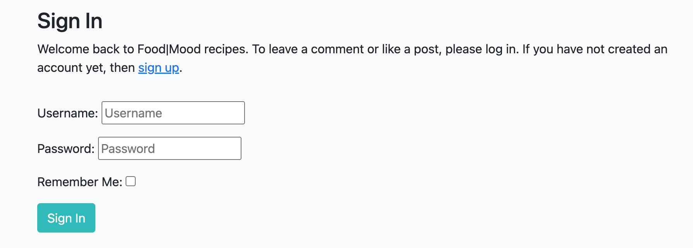
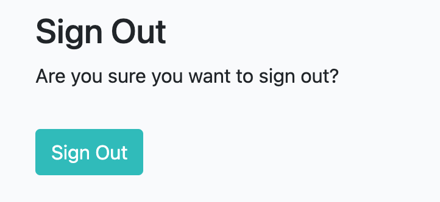
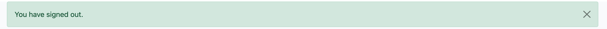
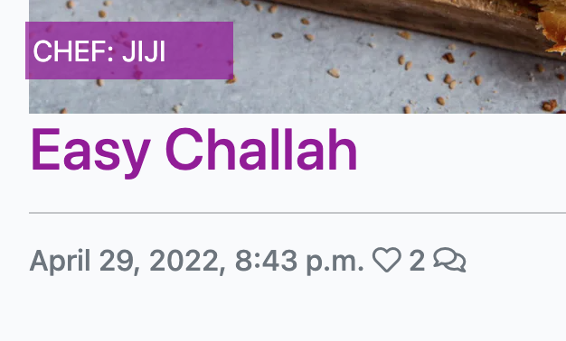
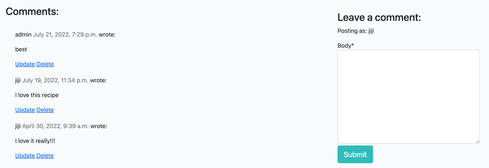

# Portfolio Project 4 - Food Mood
## Purpose

Food Mood is a Django application for food lovers.

The users can read recipes, like and comment on them.

This application was created for the purpose of completing the Portfolio 4 for the Code Institute's Full Stack Developer course and is entirely fictional.
The project covers Full Stack framework with a user centric approach in mind.  A full list of technologies used can be found in the technologies section of this document.

Here is the live version of my project. [here](https://foodupmood.herokuapp.com/)

## User Experience (UX)
The user can chech the website for new recipes and see the likes and comments on each recipe to get a better review. The user can also login to be able to like recipes as well as comment on them. The user will be able to update their comments and delete them as well.

### User stories
* As a user, I want to be able to read recipes
* As a user, I want to be able to register, login and logout
* As a user, I want to be able to like and comment 
* As a user, I want to be able to remove my likes and comments 
* As a user, I want to be able to get notificatitons when I login or logout as well when I post a comment

#### First Time Visitor Goals
* Get some nice cooking recipes
* Having a list view of all recipes as well as seperated detailed recipes view
* Register and login, for more interaction

#### Returning Visitor Goals
* A returning user is to give feedback on a tried recipe, or to try another one

#### Frequent Visitor Goals
* Frequent visitors will create a community of food lovers that can share their own ideas and opinions about recipes and help others byt replying to their problems

### Languages used
* HTML, CSS, JavaScript, Python+Django
* Relational database (recommending MySQL or Postgres)

## Features
* The user can register, login or logout

* As well as they get notifications messages when they do or when they comment

* The user can see details of the recipe author and date created as well as the count of likes and comments of each recipe on the main page with the list view of all recipes

* The authenticated user can like/dislike and comment on recipes

* A non-registered user can only read comments and see how many likes each recipe has

* The footer has external links to social media accounts

## Future features:
- Add videos to the recipes
- Rate recipes
- Search for specific food
- Reply on other users comments
- Give users the ability to create a recipe

### Testing

I have manually tested this project by doing the following:
- Tested in my local terminal and the Heroku terminal.

### Bugs
## Solved Bugs
- Getting the comments to show on the recipe_detail.html as well being able to write one

## Remaining Bugs
- Updating and deleting comments are not set yet as part of the CRUD functionality

## Validator Testing
- The validator shows an error caused by crispy forms, The crispy form is causing an error on the recipe_details pages that I can't fix:
* Here is an example [https://validator.w3.org/nu/?doc=https://foodupmood.herokuapp.com/easy-candy-apples/]

- Those pages are validate and have no more issues
* Index.html [https://validator.w3.org/nu/?doc=https://foodupmood.herokuapp.com/]
* signup.html [https://validator.w3.org/nu/?doc=https://foodupmood.herokuapp.com/accounts/signup/]
* login.html [https://validator.w3.org/nu/?doc=https://foodupmood.herokuapp.com/accounts/login/]

- PEP8
    - No errors were returned from PEP8online.com

## Deployment

To deploy the project, allow other people to run the app and see it working, there are 3 methods to allow you to complete these actions:

### Forking and Cloning

Accessing GitHub and navigating to my repositories will allow users to copy my code directly from the source, either by forking or cloning: Accessing the base repository and clicking on the code button next to Gitpod link will bring up a drop-down to create a repository of your own in your own GitHub repo. You can also download a zip file and copy the information into a new file of your own making to continue working on it.

### Local Deployment

For my local deployment, I use Gitpod to edit and run my terminal;
- From GitHub, once the repository has been created (either as a new project or by forking/cloning) I will then click on the Gitpod button to implement the creation of a workspace to edit the promotional sales review system.

***The workspace should not be closed due to the env.py file - as it is never added to GitHub, if you create a new workspace you will need to re-add the env.py file and reinstall all libraries used each time. Pinning a workspace and accessing it from Gitpod workspaces rather than GitHub button would prevent this loss of information each time***

### Remote Deployment

For this project, remote deployment is a complex procedure and I will list out the complete steps to make your site work on a separate hosting service; For my project, I will be using Heroku.

- This first step, once we are in Gitpod, is to install our required packages and libraries:
    - Using Command Line Interface (CLI) in the terminal, type:

            pip3 install Django==3.2 gunicorn
            pip3 install dj_database_url psycopg2
            pip3 install dj3-cloudinary_storage

    - we need to add these to our requirements.txt file using the CLI:

            pip3 freeze --local > requirements.txt

- We now need to build our Project structure using the CLI:

        django-admin startproject PROJ_NAME .

***The trailing full stop is very important so please don't forget to include it in your command***

    - For my project, I named it projectFour, but you can choose anything.

- Once we have the project, we need to create an actual app to handle our individual functions:
    
        python3 manage.py startapp APP_NAME

    - My app is called collection as it is designed to handle my collection of characters, comments, series, and suggestions.

- Now we have an app, we need to add it t our approved INSTALLED_APPS in the Project settings.py file

- Once they are linked, we have to migrate changes to our database - by creating the app we have created a models.py file that handles our database designs and these have to be migrated over to the database to function. To do this, in the CLI terminal, type:

        python3 manage.py migrate

- To test if this is correctly built, in CLI, type:

        python3 manage.py runserver

This has built the foundation for our project, now we need to get the Heroku App built to receive the information from Github.

- In Heroku.com create/sign in to account and then navigate to the dashboard and create a new app with an appropriate APP_NAME and set the region to whichever is most appropriate - for myself it was Europe.
- We need to add a database to the app to store our uploaded record entries: For this, we need to go to the Resources tab and run a search for the Add-on called 'Heroku Postgres'
- in the Settings tab, we can now click Reveal Config Vars and we have a new KEY/VALUE pair for our DATABASE_URL with a Postgres:// address. Copy the Value in its entirety.

We will now be swapping between our Dev Environment as well as Heroku to complete deployment.

- In our Dev Environment, we need to create a new env.py file to handle all the values that we need to keep secret. This must be at the top level of our file structure. We need to import a library and define some details into this file:

        import os

        os.environ["DATABASE_URL"] = "paste postgres:// here"

        os.environ["SERCRET_KEY"] = "input a secret key"

***There are secret key generators online to help you generate one, or you can simply put a random string of letters together***

- Take the secret key value and head to the Heroku dashboard to reveal config vars again.
    - This time add a new key called SECRET_KEY
    - Paste in the value you copied from the env.py file

- In our settings.py file, we now need to make sure our project references the new variables from the env.py file, so we need to add below the current imports Path line:

        import os
        import dj_database_url

        if os.path.isfile("env.py"):
           import env

- There is already a secret_key variable, but we need to replace the existing value with os.environ.get("SECRET_KEY")
- We have a databases variable already assigned as well, but we are going to comment out this existing section and replace it with our own:

        DATABASES_URL = {
            'default': dj_database_url.parse(os.environ.get("DATABASE_URL"))
        }

- Now we have linked up a new Database, we need to migrate our files again to make sure they are linked - In CLI type:

        python3 manage.py migrate

Along with our DevEnv and Heroku, we also need one additional facility to handle our static and media files: Cloudinary

- In a browser, navigate to Cloudinary.com and sign in/up for an account.
- Once in, you will have, on your dashboard, a set of information for linking your DevEnv and Heroku to it.
    - Copy the CLOUDINARY_URL (also known as the API Environment Variable) value and head over to the env.py file:

            os.environ["CLOUDINARY_URL"] = "cloudinary:// pasted here"

    - Back in Heroku, settings, reveal config vars, add new Key/Value pair called CLOUDINARY_URL with the "Cloudinary:// value"
    - The last thing we need to add to our Heroku, for now, is the DISABLE_COLLECTSTATIC Key with the value set to 1.

- In our INSTALLED_APPS in the setting.py file, we must now add a couple of new lines:

        'cloudinary_storage',    //this must go above staticfiles
        'django.contrib.staticfiles',    //this already exists
        'cloudinary',    //this must go below the staticfiles

***The order of these lines is very important so make sure they are in the correct order!!!***

- For our app to use the correct storage location, we need to tell our settings.py file the correct Cloudinary information. Below the STATIC_URL = "/static/", add:

        STATICFILES_STORAGE = 'cloudinary_storage.storage.StaticHashedCloudinaryStorage'
        STATICFILES_DIRS = [os.path.join(BASE_DIR, 'static')]
        STATIC_ROOT = os.path.join(BASE_DIR, 'staticfiles')

        MEDIA_URL = '/media/'
        DEFAULT_FILE_STORAGE = 'cloudinary_storage.storage.MediaCloudinaryStorage'

- We now need to link the file to the templates directory in Heroku. Under the BASE_DIR line, add:

        TEMPLATES_DIR = os.path.join(BASE_DIR, 'templates')

- We need to tell the templates directory where we will find the templates we will be using, so in TEMPLATES, in the 'DIRS' variable list, we need to add 

        'DIRS': [TEMPLATES_DIR],

- The last thing in our settings.py file we need to include, is the host locations for running our app. We need one for Heroku and one for our local DevEnv, so we just need to adjust the following:

        ALLOWED_HOSTS = ["PROJ_NAME.herokuapp.com", "localhost"]

- So now we have storage for our files, we need to add our folders to the correct locations - in our top level of the directory, we now need to add media, static, and templates.

- We need to create a file that tells Heroku exactly how we expect the app to be run, so we need to create the Procfile (The initial cap is intentional) in the top level of the directory.
- In Procfile, we need to add:

        web: gunicorn PROJ_NAME.wsgi

- We now need to save the files and structure we have created in gitpod to our GitHub repository using the CLI:

        git add .
        git commit -m "deployment commit"
        git push

- Once this has been pushed to our main branch, we need to get our main branch deployed to Heroku.

- In Heroku, Deploy tab, we can add our Github repository to the deployment method. Once this is linked, we can scroll down and deploy the main branch.

At this point, the same screen from our 'runserver' test should now be displayed on the deployed webpage. This is the basic deployment of the app completed.

For final deployment:

- Change DEBUG to False in our settings.py file

- Add X_FRAME_OPTIONS = 'SAMEORIGIN'

This completes the settings part of Luke's Animé Base, but we still need to upload the final settings with:

        git add .
        git commit -m "deployment commit"
        git push

This should now have the final design of your site all working perfectly. You have successfully deployed the site!

***JUST TO REITERATE - For final deployment of site, remember to switch debug to False as this will allow anyone to gain access to secret information***

### Frameworks, Libraries & Programs used
* [GitHub](https://github.com/)
	* GithHub is the hosting site used to store the source code for the Website and [Git Pages](https://pages.github.com/) is used for the deployment of the live site.
* [GitPod](https://gitpod.io/)
	* GitPod is used as version control software to commit and push code to the GitHub repository where the source code is stored.
* [Am I Responsive?](http://ami.responsivedesign.is/)
	* Used to generate the screenshots for responsive design.

### Credits
- www.delish.com for the recipes and images
- To my Mentor [Chris Quinn](https://github.com/10xOXR) who has been an exceptional help throughout the course, so far.
